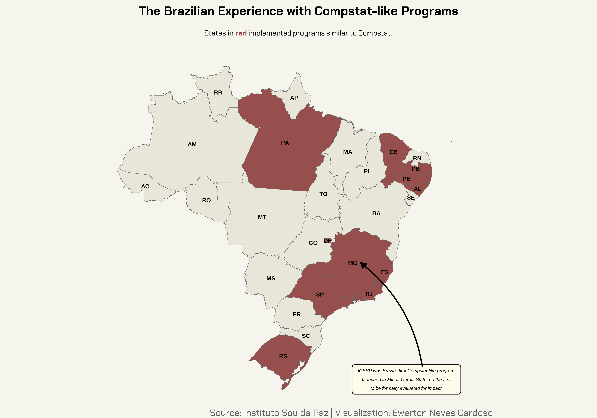
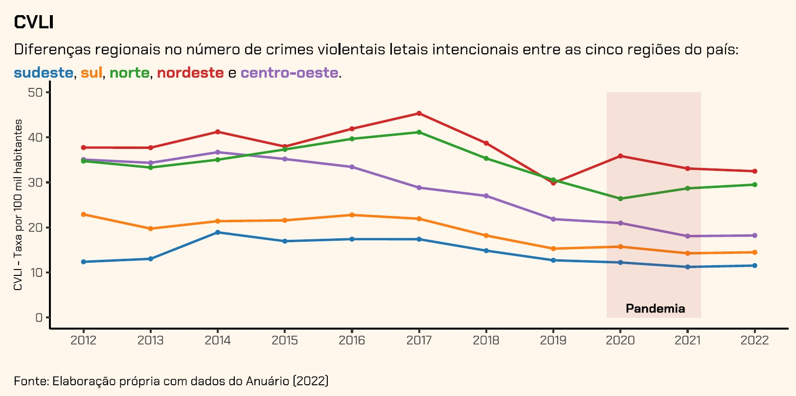

# data_criminality_brazil

The project's objective is to present a contemporary snapshot of public security in Brazil.

# Public Policy

## Compstat-like Programs

Results-based management programs have gained worldwide recognition, largely due to the success of Compstat in New York. These Compstat-inspired programs integrate various policing approaches and are guided by several key principles: (i) the establishment of measurable objectives by geographic area; (ii) internal accountability, with regular meetings attended by political authorities and security forces; (iii) geographic organization of command, granting district commanders the authority and resources needed to achieve targets in specific areas; (iv) organizational flexibility; (v) data-driven identification and assessment of problems; and (vi) the use of innovative tactics in problem-solving.

Additionally, the Brazilian versions of these programs include the alignment of operational areas between the two police agencies-the Military Police and the Civil Police. To facilitate this, Integrated Areas of Public Security (Áreas Integradas de Segurança Pública, or AISP) were created. These integrated areas promote the sharing of information and the standardization of actions between the two agencies, helping to overcome previous barriers to effective policing.

Compstat-like programs are currently implemented in 11 Brazilian states, as shown in the figure below.

# The Pandemic's Effect

The Covid-19 pandemic represented an extraordinary event in the annals of human history, resulting in the transformation of multiple behavioral paradigms. Consequently, we are leveraging the exogenous variability stemming from the global sanitary crisis to investigate the potential ramifications on criminal behavioral patterns. This work is based on descriptive statistic analysis.

## Crimes against life

